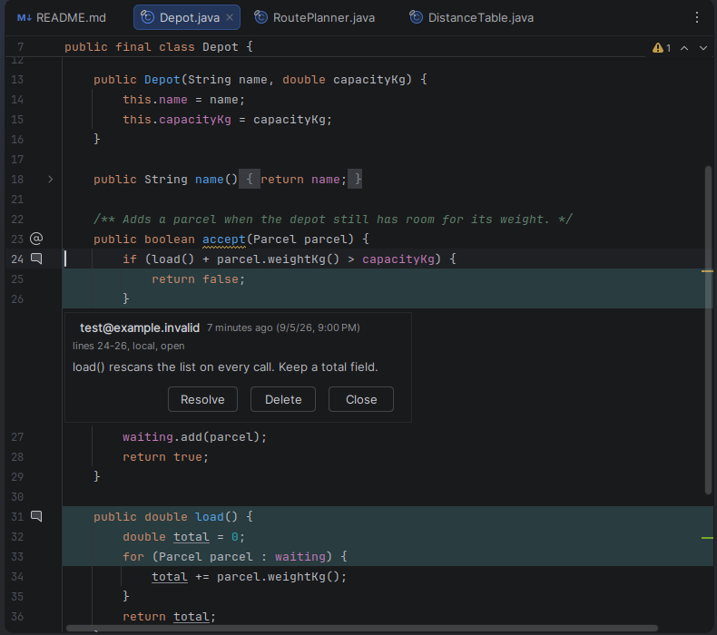
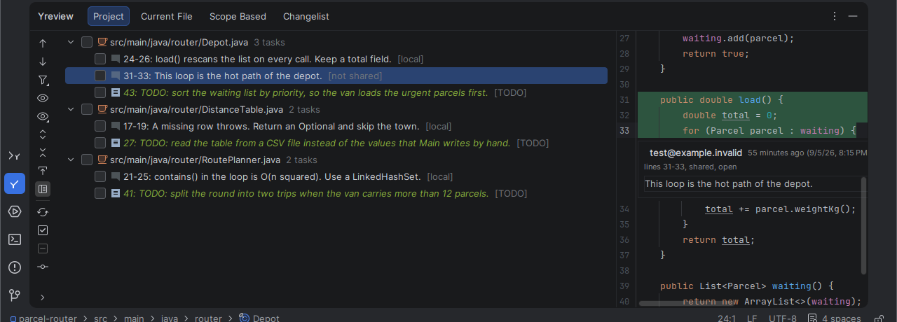
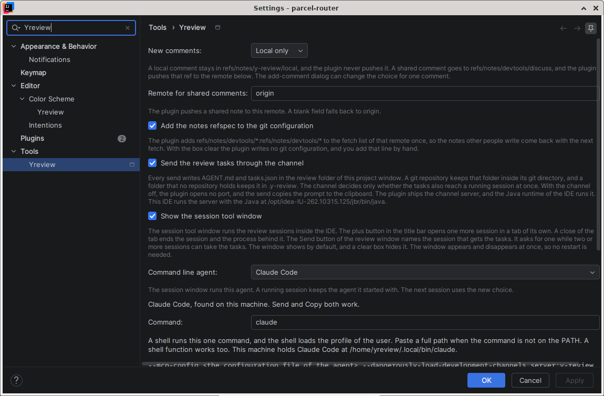

  

# Yreview

Yreview writes code review comments on any line of the editor and on any line of a diff,
inside IntelliJ IDEA. It stores each comment as a git note in your own repository, in the
git-appraise format, so a comment travels with the code and needs no server and no account.
It also lists every open comment and every TODO item of the project in one tool window. It
hands those tasks to a command line agent that runs in a tool window of the IDE. The plugin
knows nine agents, and it also runs a command that you type.

Nothing leaves your machine. The plugin has no server, and the author receives no data. See
[Privacy](#privacy).

- Reference: [docs/reference.md](docs/reference.md)
- License: [Apache License 2.0](LICENSE)
- Contribute: [CONTRIBUTING.md](CONTRIBUTING.md)
- Report a problem: https://github.com/yeskiy/yreview/issues
- The steps of a good report: [docs/reference.md](docs/reference.md#report-a-problem)
- Report a security weakness in private: [SECURITY.md](SECURITY.md)

## What it does

Write a comment on one line or on a range of lines. The action sits in the editor context
menu, in the intention list under Alt and Enter, and on the shortcut Control Shift G. The
same action works on both sides of a diff, and the plugin records the revision of the side
you clicked.

The plugin marks a commented range with a gutter icon and a quiet background. A click on
the icon opens a card inside the editor. The card reads Markdown, and it carries a Resolve
button and a Delete button.

The tool window lists every open comment and every TODO item of the project. It holds four
tabs, Project, Current File, Scope Based, and Changelist. Each tab groups by module or by
directory, filters by kind, and opens a preview beside the tree.

One button hands the open tasks to a command line agent. The agent runs in a tool window of
the IDE, and the settings page names it. Claude Code takes the tasks while the session runs,
through a channel of the plugin. OpenCode takes them over a loopback port of its own. Every
other agent reads them from the clipboard, and from the two files that each send writes in
the git directory. When the agent reports that a task is done, the plugin marks the comment
resolved.

[docs/reference.md](docs/reference.md#where-the-comments-are-stored) says where each comment
goes, what one record holds, and every file the plugin writes.

## Features

**The comment**

- Write a comment on one line, or on a range of lines.
- Write a comment on either side of a diff. The plugin records the revision of the side
  you clicked.
- Start the action from the editor context menu, or from the intention list under Alt and
  Enter.
- The shortcut Control Shift G starts the same action.
- A gutter icon and a quiet background mark a commented range.
- A card opens inside the editor. The card reads Markdown, and it carries a Resolve button
  and a Delete button.

**The storage**

- The plugin stores each comment as a git note in your own repository, in the git-appraise
  format.
- The plugin needs no server and no account.
- A local comment and a shared comment go to separate note refs.
- The plugin pushes the shared note ref to your git remote.
- A file that no git repository covers still takes a comment. The plugin keeps that comment
  in a `.y-review` folder, and it moves the records into the git notes later.

**The task list**

- The tool window lists every open comment and every TODO item of the project.
- The window holds four tabs, Project, Current File, Scope Based, and Changelist.
- Each tab groups by module or by directory, filters by kind, and opens a preview pane.

**The command line agent**

- One button hands the open tasks to a command line agent.
- The agent runs in a tool window of the IDE.
- Claude Code takes a task while the session runs, through a channel of the plugin.
- OpenCode takes a task over a loopback port of its own.
- Every other agent reads the tasks from the clipboard, and from the files `AGENT.md` and
  `tasks.json`.
- The plugin marks a comment resolved when the agent reports that the task is done.

**The report**

- One action copies a diagnostic report of the plugin.
- Another action opens a filled issue form after a crash of the IDE.
- Nothing leaves your machine, and the plugin sends no measurement of any kind.

## Command line agents

The settings page lists nine agents: Claude Code, OpenCode, OpenAI Codex CLI,
Antigravity CLI, Gemini CLI, GitHub Copilot CLI, Cursor CLI, Aider, and Amp. The page also
runs a command that you type, and it runs nothing at all after you choose No agent.

| Agent              | How the tasks reach it                                   |
|--------------------|----------------------------------------------------------|
| Claude Code        | A channel of the plugin, while the session runs          |
| OpenCode           | A loopback port of its own                               |
| OpenAI Codex CLI   | The clipboard, and the files `AGENT.md` and `tasks.json` |
| Antigravity CLI    | The clipboard, and the files `AGENT.md` and `tasks.json` |
| Gemini CLI         | The clipboard, and the files `AGENT.md` and `tasks.json` |
| GitHub Copilot CLI | The clipboard, and the files `AGENT.md` and `tasks.json` |
| Cursor CLI         | The clipboard, and the files `AGENT.md` and `tasks.json` |
| Aider              | The clipboard, and the files `AGENT.md` and `tasks.json` |
| Amp                | The clipboard, and the files `AGENT.md` and `tasks.json` |
| Another agent      | The clipboard, and the files `AGENT.md` and `tasks.json` |
| No agent           | The clipboard, and the files `AGENT.md` and `tasks.json` |

[docs/reference.md](docs/reference.md#what-the-plugin-runs) says what the plugin runs for
each agent, and which flags it adds.

## Requirements

| Item                 | Version                             | Needed                                                                              |
|----------------------|-------------------------------------|-------------------------------------------------------------------------------------|
| IntelliJ IDEA        | 2026.2 or newer, build 262 or newer | Yes. The plugin declares no upper build limit.                                      |
| Git                  | Any current version, on the PATH    | Yes. The plugin runs the `git` program of your machine.                             |
| A command line agent | Any current version                 | No. Without one every comment feature works, and only the review session stays out. |

The plugin depends on the bundled Git plugin. It needs no Node.js and no account.

## Install

**From the JetBrains Marketplace.** Open the
[plugin page](https://plugins.jetbrains.com/plugin/34134-yreview) and press Install. You can
also search for `Yreview` under Settings, Plugins, Marketplace. Restart the IDE after the
install.

**From an archive.** Download `y-review-<version>.zip` from the
[releases page](https://github.com/yeskiy/yreview/releases). Open Settings, Plugins, press
the gear icon, then Install Plugin from Disk. Pick the archive, then restart the IDE.

**From source.** Read [CONTRIBUTING.md](CONTRIBUTING.md). One command builds the archive.

## Settings

Open Settings, Tools, Yreview.

[docs/reference.md](docs/reference.md#settings-reference) holds every setting, its default,
and what it does.

## Privacy

Nothing leaves your machine. The plugin has no server, and the author receives nothing.

The plugin never sends:

- the text of a comment,
- the name or the address of an author,
- the content of a file, a path, or a repository name,
- a token, a key, or a password,
- a usage count, a crash report, or any other measurement.

The plugin opens one port on `127.0.0.1` and nothing else. Two things reach the network,
and you start both.

1. The git push of a shared comment. It goes to your own git remote, and it carries the
   note ref only.
2. The command line agent, when you start a review session. That agent talks to its own
   service under its own settings and its own account. The plugin starts the program and
   adds no data of its own to that traffic.

Read [SECURITY.md](SECURITY.md) for the full list of what the plugin touches.

## License

Apache License 2.0. See [LICENSE](LICENSE) for the full text and [NOTICE](NOTICE) for the
third-party components the archive carries.
